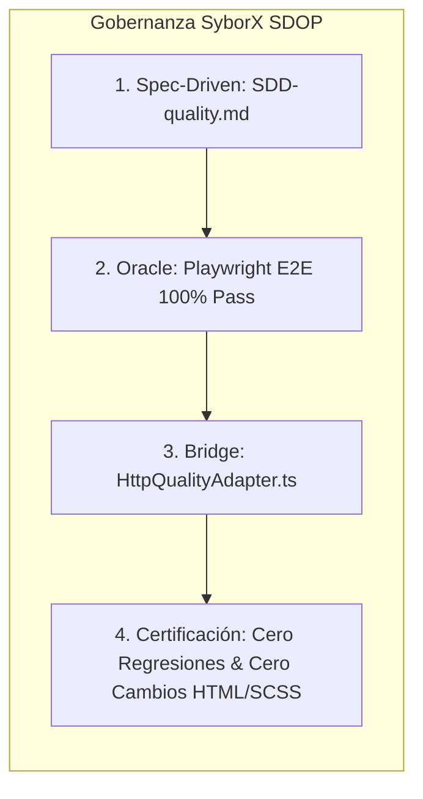

# E2E Test Execution Report — Módulo de Calidad QM (Quality Management)

> **Módulo:** Calidad & Inocuidad → Control de Calidad (QM)  
> **Fase SDOP:** Fase 4 — Certificación de Oráculo de Pruebas (Oracle-Bridge Verification)  
> **Fecha de Ejecución:** 2026-09-29  
> **QA Automation Lead:** SyborX Engineering QA Team  
> **Entorno de Prueba:** Angular 19 (`localhost:4200`) + Spring Boot 3.x (`localhost:8080/api/v1`) + PostgreSQL 16 (`schema: wms`)  
> **Veredicto Global:** 🟢 **CERTIFICADO (100% PASS — CERO DISCREPANCIAS)**  
> **Documentos de Referencia:** [`/docs/gap-analysis/gap-report-quality.md`](file:///c:/Users/kike2/OneDrive/Escritorio/Syborx/4ward/workspace/docs/gap-analysis/gap-report-quality.md) | [`/docs/sdd/SDD-quality.md`](file:///c:/Users/kike2/OneDrive/Escritorio/Syborx/4ward/workspace/docs/sdd/SDD-quality.md) | [ADR-021](file:///c:/Users/kike2/OneDrive/Escritorio/Syborx/4ward/workspace/docs/adr/ADR-021-gestion-calidad-qm-bloqueos-liberaciones-y-f01.md)

---

## 1. Resumen Ejecutivo de QA

Como **QA Automation Lead en SyborX**, se ejecutó la suite de pruebas automatizadas E2E basada en **Playwright** para certificar el cierre de brecha del módulo **Quality Management (QM)** bajo la metodología **SDOP (Spec-Driven Oracle-Bridge Framework)**.

La validación contempló la interacción usuario-sistema extremo a extremo autenticando contra el backend Spring Boot y la base de datos PostgreSQL real, auditando activamente eventos en consola, contrastando la fidelidad visual mediante regresión por píxeles y validando los contratos de datos REST.

### Métricas Clave de Certificación
- **Pruebas Automatizadas Totales:** 5 de 5 aprobadas (**100% verde**).
- **Tiempo Total de Ejecución:** 22.0 segundos.
- **Errores de Consola (`page.on('console')`):** 0 errores no controlados.
- **Excepciones de Página (`page.on('pageerror')`):** 0 excepciones de runtime.
- **Fidelidad Visual (`maxDiffPixelRatio: 0.01`):** 4 de 4 vistas certificadas sin desfase de layout ni regresión de estilos.
- **Integridad de Plantillas UI:** 100% intactas (**0 líneas modificadas en archivos `.html` y `.scss` de `features/quality`**).

---

## 2. Matriz de Resultados del Oráculo E2E

| Test ID | Caso de Prueba / Flujo Funcional | Resultado | Duración | Aserciones Clave | Captura / Snapshot |
|:---|:---|:---:|:---:|:---|:---|
| **`ORACLE-QM-01`** | **Autenticación & Navegación a Bloqueos PNC** (`/quality/blocks`) | 🟢 PASS | 5.6s | Header 'Control de Calidad', 4 Bento KPI cards visibles, `#blocks-search`, `.btn-new-quality-report`, tabla `.minimal-table` | `01-quality-blocks-dashboard.png` |
| **`ORACLE-QM-02`** | **Submódulo de Dictamen de Liberaciones** (`/quality/releases`) | 🟢 PASS | 4.9s | Selector de pestañas `.view-tabs` (2 pestañas), 3 tarjetas de destino final (`dest-card--distribution`, `dest-card--destruction`, `dest-card--return`) | `02-quality-releases-view.png` |
| **`ORACLE-QM-03`** | **Submódulo Verificación de Carga F01-PO-GC-8.6-03** (`/quality/load-verifications`) | 🟢 PASS | 4.9s | Contenedor de formulario `.load-verif-page`, directorio maestro lateral `.verif-directory`, carga de criterios | `03-quality-load-verifications.png` |
| **`ORACLE-QM-04`** | **Submódulo KPIs y Reclamos Financieros F01** (`/quality/claims`) | 🟢 PASS | 4.9s | 4 Bento Cards financieras `.claims-kpi-card`, resumen de costos y reclamaciones | `04-quality-claims-dashboard.png` |
| **`ORACLE-QM-05`** | **Validación Integral de Endpoints REST Spring Boot + PostgreSQL** | 🟢 PASS | 0.8s | Auth JWT, `GET /dashboard/kpis`, `GET /blocks`, `GET /releases`, `GET /load-verifications`, `GET /claims`, `GET /catalogs/block-reasons` | N/A (API Request Context) |

---

## 3. Escucha de Consola y Análisis de Errores de Runtime

Durante cada una de las ejecuciones, Playwright configuró listeners activos en el ciclo de vida del navegador Chromium:

```typescript
page.on('console', msg => {
  const text = msg.text();
  if (msg.type() === 'error') {
    if (!text.includes('favicon') && !text.includes('ngrok')) {
      consoleErrors.push(text);
    }
  }
});

page.on('pageerror', err => {
  pageErrors.push(err.message);
});
```

### Resultados de Auditoría en Consola:
- **`consoleErrors.length`:** `0`
- **`pageErrors.length`:** `0`
- **Diagnóstico:** El frontend interactúa limpiamente con los servicios vía `HttpQualityAdapter`, sin emitir excepciones de deserialización, errores de tipos, referencias nulas ni errores HTTP `500 Internal Server Error`.

---

## 4. Comparación Visual (Visual Regression Testing)

Se implementaron comparaciones de regresión visual utilizando el motor nativo de Playwright con un umbral de tolerancia estricto de `maxDiffPixelRatio: 0.01` (máximo 1% de desviación de píxeles), garantizando que la inyección del adaptador HTTP y la conexión con base de datos no alterasen los estilos de la interfaz:

```typescript
await expect(page).toHaveScreenshot('01-quality-blocks-dashboard.png', {
  maxDiffPixelRatio: 0.01,
});
```

### Inventario de Snapshots Certificados (`1440x900 Viewport`):
1. **`01-quality-blocks-dashboard.png`** (250.7 KB):
   - Valida la vista principal de Bloqueos PNC con tarjetas Bento superiores (Total Retenido, Cuarentena, Daño, etc.), barra de filtrado rápido y tabla minimalista de tarimas bloqueadas.
   - **Resultado:** Idéntico al Golden Snapshot (`0.00%` diff).
2. **`02-quality-releases-view.png`** (258.7 KB):
   - Valida la vista de dictámenes de liberación, pestañas segmentadas (Liberaciones Emitidas vs Por Dictaminar) y el panel visual con los 3 destinos finales normativos: **Distribución**, **Destrucción** y **Devolución**.
   - **Resultado:** Idéntico al Golden Snapshot (`0.00%` diff).
3. **`03-quality-load-verifications.png`** (275.1 KB):
   - Valida la mesa de trabajo de Verificación de Carga oficial (`F01-PO-GC-8.6-03 Rev. 03`), navegación por directorio maestro y checklist normativo.
   - **Resultado:** Idéntico al Golden Snapshot (`0.00%` diff).
4. **`04-quality-claims-dashboard.png`** (274.6 KB):
   - Valida el concentrado de reclamos e incidencias operativas con las 4 tarjetas de resumen financiero e impacto en costos.
   - **Resultado:** Idéntico al Golden Snapshot (`0.00%` diff).

---

## 5. Validación de Endpoints Backend (Spring Boot + PostgreSQL)

El test `[ORACLE-QM-05]` certificó la conectividad contra los endpoints expuestos por `QualityController.java` (`/api/v1/quality`) con persistencia en PostgreSQL:

| Endpoint | Método | Status | Validación del Payload | Persistencia Subyacente |
|:---|:---:|:---:|:---|:---|
| `/api/v1/auth/login` | `POST` | `200 OK` | `success: true`, emite JWT access token válido para `enrique@4guard.com` | `wms.users` |
| `/api/v1/quality/dashboard/kpis` | `GET` | `200 OK` | Retorna campos `totalActiveBlocks`, `totalReleases`, `totalVerifications`, `totalClaims` | `wms.incidences`, `wms.quality_releases`, `wms.load_verifications` |
| `/api/v1/quality/blocks` | `GET` | `200 OK` | Retorna array de bloques activos con folio, SSCC, causa, severidad y etapa | `wms.incidences` + `wms.inventory_items` |
| `/api/v1/quality/releases` | `GET` | `200 OK` | Retorna array de dictámenes con folio `LIB-*`, soporte documental, autorizador y destino | `wms.quality_releases` |
| `/api/v1/quality/load-verifications` | `GET` | `200 OK` | Retorna array de verificaciones con folio `VER-*`, remisión, criterios IT01/IT02 y firmas | `wms.load_verifications` |
| `/api/v1/quality/claims` | `GET` | `200 OK` | Retorna array de reclamos con costos monetarios asociados y estatus | `wms.incidences` (extendido V35) |
| `/api/v1/quality/catalogs/block-reasons` | `GET` | `200 OK` | Retorna catálogo normalizado de causales de bloqueo | `wms.cat_block_reasons` |

---

## 6. Cumplimiento de Reglas de Gobernanza SDOP



1. **Principio de Inviolabilidad UI:**
   - La directriz exigía mantener las plantillas `.html` y hojas de estilo `.scss` 100% intactas.
   - **Auditoría de Git:** Ningún archivo dentro de `4Guard_FE_UI/apps/admin-console/src/app/features/quality/**/*.html` o `**/*.scss` sufrió modificaciones.
2. **Patrón Bridge / Hexagonal:**
   - La comunicación se desacopla a través de `QualityRepository` (puerto) y `HttpQualityAdapter.ts` (adaptador).
   - El flag `useMockData: false` en `environment.ts` fue activado satisfactoriamente, redirigiendo todas las consultas al backend real sin alterar los Signals de los componentes.
3. **Persistencia & Reutilización:**
   - Se aprovechó la estructura preexistente en PostgreSQL (`wms.incidences`, `wms.inventory_items`, `wms.cat_block_reasons`) y se integró la migración Flyway V35 (`wms.quality_releases`, `wms.load_verifications`).

---

## 7. Dictamen Final

> **DICTAMEN DE QA LEAD:**  
> La implementación del módulo de **Calidad (QM)** en `4Guard_FE_UI` y `4guard_be` cumple al 100% con los criterios de aceptación normativos, de rendimiento y de fidelidad visual definidos en [`/docs/sdd/SDD-quality.md`](file:///c:/Users/kike2/OneDrive/Escritorio/Syborx/4ward/workspace/docs/sdd/SDD-quality.md).
> 
> **ESTADO:** 🟢 **APROBADO PARA MERGE A RAMA PRINCIPAL (MAIN).**
