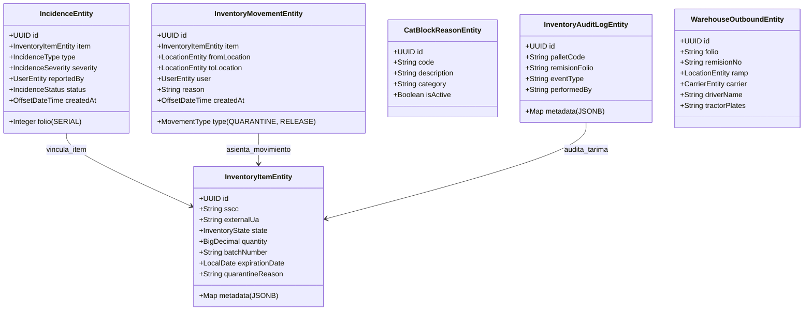

# GAP Analysis Report — Módulo `quality` (QM)
**Módulo:** Control de Calidad, Bloqueo de Producto No Conforme (PNC), Dictamen de Liberaciones y Verificación de Carga F01-PO-GC-8.6-03 Rev. 03  
**Generado:** 2026-09-29  
**Metodología:** SDOP — Demo-Gap Analysis (READ-ONLY)  
**Fuente FE:** `4Guard_FE_UI/apps/admin-console/src/app/features/quality`  
**Fuente BE:** `4guard_be` (Spring Boot 3.x / Hexagonal Architecture / PostgreSQL schema `wms`)  
**Analista:** Antigravity IDE (Pair Programmer SyborX)  

---

## 1. Resumen Ejecutivo

El módulo de **Calidad (QM)** en el frontend (`4Guard_FE_UI`) presenta una arquitectura visual y reactiva altamente avanzada, estructurada en un Shell principal (`QualityShellComponent`) con Bento KPIs y cuatro submódulos especializados:
1. **Bloqueos y Producto No Conforme (`BlocksSubmoduleComponent`):** Registro y clasificación de retenciones en 4 etapas operativas (`INBOUND_UNLOAD`, `STORAGE`, `OUTBOUND_LOAD`, `TEST_MATERIAL`) con 4 tipificaciones de defecto y gestión de evidencias.
2. **Dictamen de Liberaciones y Destinos (`ReleasesSubmoduleComponent`):** Protocolo de dictamen formal emitido por Cliente o Calidad 4GUARD, con soporte documental (correo, acta formal, etc.) y 3 destinos finales normativos: **Distribución** (retorno a inventario disponible), **Destrucción** (baja / merma controlada) y **Devolución** (retorno a proveedor / cliente).
3. **Verificación de Carga Oficial (`LoadVerificationSubmoduleComponent`):** Digitalización estricta del formato `F01-PO-GC-8.6-03 Rev. 03` con 18 criterios normativos (instructivos `IT01-PO-GC-8.6-01` e `IT02-PO-GC-8.6-02`), firmas multinivel y exportación / impresión de comprobante oficial.
4. **KPIs y Concentrado de Reclamos (`ClaimsSubmoduleComponent`):** Matriz ejecutiva de incidencias operativas, cálculo de costos asociados ($ MXN/USD), mermas y auditoría histórica.
5. **Inspección Técnica Profunda:** Componente de ruta `/quality/inspection/:id` y modal reutilizable de checklist técnico.

### Diagnóstico de Conectividad
A pesar de su madurez en interfaz, el módulo en el frontend opera actualmente de forma **100% aislada en memoria**. El servicio central `QualityStateService` utiliza exclusivamente Angular Signals con colecciones iniciales mockeadas; **no realiza ninguna llamada HTTP hacia Spring Boot** (0% conectividad REST) ni persiste en `localStorage`. Cuando se dictamina una liberación para distribución, el servicio delega en `WarehouseMovementsService.addReleasedInventoryStock()`, el cual únicamente actualiza un signal en memoria del cliente sin impacto en base de datos.

### Diagnóstico de Backend y Oportunidad de Reutilización
En el backend (`4guard_be`), **no existen aún controladores REST ni servicios de aplicación dedicados a Calidad** (`QualityController` y `QualityService` no existen). Sin embargo, el backend cuenta con una infraestructura hexagonal de base de datos y puertos de persistencia con **componentes de alto valor diseñados específicamente para calidad y trazabilidad que DEBEN ser reutilizados**:
- **Entidades JPA Reutilizables:** `IncidenceEntity` (`wms.incidences`, Sección 4 de schema inicial), `InventoryItemEntity` (con soporte para `InventoryState.IN_QUALITY`, `quarantine_reason` y metadatos JSONB), `InventoryMovementEntity` (con enums nativos `MovementType.QUARANTINE` y `MovementType.RELEASE`), `InventoryAuditLogEntity` (Árbol de la Vida del pallet), `CatBlockReasonEntity` (`wms.cat_block_reasons`), `WarehouseReceptionPalletEntity`, `WarehouseOutboundEntity` (para enlace directo con la verificación de carga F01) y `LocationEntity`.
- **Puertos de Salida (Outbound Ports) Reutilizables:** `IncidenceRepositoryPort` (ya adaptado con JPA), `InventoryItemRepositoryPort`, `InventoryMovementRepositoryPort`, `InventoryAuditLogRepositoryPort`, `LocationRepositoryPort`, `ProductSkuRepositoryPort`, `ClientRepositoryPort`, `WarehouseOutboundRepositoryPort` y `NotificationRepositoryPort`.

### Cobertura Global

| Componente / Dimensión | Estado | Observación |
|:---|:---:|:---|
| **Tabla PostgreSQL Incidencias / Calidad** (`wms.incidences`) | ✅ Sí | Creada en V1. Mapea tipo, severidad, item, usuario y folio SERIAL. |
| **Tabla Catálogo Motivos Bloqueo** (`wms.cat_block_reasons`) | ✅ Sí | Creada en V23/V26 con 7 causales sembradas (`BLOQ_CALIDAD`, etc.). |
| **Tabla Trazabilidad Kardex** (`wms.inventory_movements`) | ✅ Sí | Esquema transaccional con `QUARANTINE` y `RELEASE` predefinidos. |
| **Tabla Bitácora de Auditoría** (`wms.inventory_audit_log`) | ✅ Sí | Diseñada para eventos granulares por tarima, SSCC y remisión. |
| **Tabla de Dictamen de Liberaciones** (`wms.quality_releases`) | ❌ No | Inexistente en BD. Se requiere migración Flyway. |
| **Tabla Verificación de Carga F01** (`wms.load_verifications`) | ❌ No | Inexistente en BD. Actualmente solo existe en la UI de Angular. |
| **Tabla Reclamos y Costos F01** (`wms.quality_claims`) | ⚠️ Parcial | `wms.incidences` cubre tipo/severidad, pero carece de campos de costo/etapa. |
| **Entidades JPA de Calidad e Inventario** | ⚠️ Parcial | `IncidenceEntity`, `InventoryItemEntity`, `CatBlockReasonEntity` activas. Faltan entidades de Release y Verificación. |
| **Puertos de Salida (Outbound Ports)** | ✅ Sí | 9 puertos de salida identificados y listos para inyección directa. |
| **Casos de Uso / Servicios Backend QM** | ❌ 0% | No existe `QualityService` ni `QualityUseCase` en el backend. |
| **Controlador REST Backend QM** | ❌ 0% | No existe `QualityController` (`/api/v1/quality`). |
| **Conectividad FE → BE en Módulo Quality** | ❌ 0% | Frontend desacoplado; opera 100% sobre Signals en memoria. |
| **Especificación Formal (SDD / ADR)** | ❌ No | No existe `docs/sdd/quality-management.sdd.md` en la base de especificaciones. |

---

## 2. Arquitectura del Módulo FE

### 2.1 Estructura de Componentes y Submódulos

El módulo está ubicado en `/4Guard_FE_UI/apps/admin-console/src/app/features/quality` y se compone de la siguiente jerarquía:

```
src/app/features/quality/
├── quality.routes.ts                     # Definición de rutas hijas lazy-loaded
├── models/
│   └── quality.models.ts                 # Tipos de dominio, interfaces y enums QM
├── services/
│   └── quality-state.service.ts          # Store reactivo en memoria (Angular Signals)
├── pages/
│   ├── quality-shell/                    # Shell general con Bento KPIs y pestañas
│   │   ├── quality-shell.component.ts
│   │   ├── quality-shell.component.html
│   │   └── quality-shell.component.css
│   ├── blocks-submodule/                 # Submódulo 1: Bloqueos y PNC (4 etapas)
│   │   ├── blocks-submodule.component.ts
│   │   ├── blocks-submodule.component.html
│   │   └── blocks-submodule.component.css
│   ├── releases-submodule/               # Submódulo 2: Dictámenes y Destinos
│   │   ├── releases-submodule.component.ts
│   │   ├── releases-submodule.component.html
│   │   └── releases-submodule.component.css
│   ├── load-verification-submodule/      # Submódulo 3: Formato F01-PO-GC-8.6-03
│   │   ├── load-verification-submodule.component.ts
│   │   ├── load-verification-submodule.component.html
│   │   └── load-verification-submodule.component.css
│   └── claims-submodule/                 # Submódulo 4: Dashboard y Reclamos F01
│       ├── claims-submodule.component.ts
│       ├── claims-submodule.component.html
│       └── claims-submodule.component.css
├── components/
│   ├── print-layouts/                    # Formato oficial para impresión y PDF
│   │   └── print-verification-layout.component.ts
│   └── quality-inspection-modal/         # Modal interactivo con checklist técnico
│       ├── quality-inspection-modal.component.ts
│       ├── quality-inspection-modal.component.html
│       └── quality-inspection-modal.component.css
├── quality-inspection/                   # Vista de inspección profunda (/quality/:id)
│   ├── quality-inspection.component.ts
│   ├── quality-inspection.component.html
│   └── quality-inspection.component.css
└── quality-list/                         # Componente legado / huérfano (no enrutado)
    ├── quality-list.component.ts
    ├── quality-list.component.html
    └── quality-list.component.css
```

### 2.2 Flujo Funcional y Transiciones de Estado en la UI

```
                              ┌───────────────────────────────────┐
                              │  QualityShellComponent (/quality) │
                              │    Bento KPIs & Master Router     │
                              └─────────────────┬─────────────────┘
                                                │
         ┌──────────────────────┬───────────────┴───────────────┬──────────────────────┐
         ▼                      ▼                               ▼                      ▼
┌──────────────────┐  ┌──────────────────┐            ┌──────────────────┐  ┌──────────────────┐
│ 1. Bloqueos PNC  │  │  2. Liberaciones │            │  3. Verificación │  │  4. Reclamos F01 │
│  (/quality/      │  │  (/quality/      │            │  (/quality/      │  │  (/quality/      │
│   blocks)        │  │   releases)      │            │   load-verif)    │  │   claims)        │
└────────┬─────────┘  └────────┬─────────┘            └────────┬─────────┘  └────────┬─────────┘
         │                     │                               │                     │
         ├─ Retención en 4     ├─ Soporte: Correo / Acta       ├─ 18 Criterios       ├─ Costos Daño
         │  Etapas operativas  │  Medio electrónico            │  (IT01 / IT02)      │  y Merma ($)
         ├─ Modal Inspección   ├─ Dictamen de Destino:         ├─ 5 Firmas           ├─ Detección por
         │  Checklist técnico  │  • DISTRIBUCIÓN               │  institucionales    │  Etapa operativa
         └─ Traspaso a Dictamen│  • DESTRUCCIÓN                └─ Emisión Pauta/PDF  └─ Folio de Cierre
            (QueryParam)       │  • DEVOLUCIÓN                    F01-PO-GC-8.6-03      Inmutable
                               └─ Impacto en Stock Kardex
```

---

## 3. Estado de la Persistencia Frontend (`QualityStateService`)

El servicio `QualityStateService` actúa como el único origen de verdad del módulo en el frontend. Sus características determinantes son:

1. **Estado en Memoria Exclusivo:** Los signals `blocks`, `releases`, `loadVerifications` y `claims` se inicializan con arrays estáticos predefinidos. Si el usuario recarga la página (`F5`), cualquier registro, bloqueo o dictamen creado se pierde.
2. **Ausencia de Adaptador HTTP:** No inyecta `HttpClient` ni consume ningún endpoint REST del backend.
3. **Interacción Cruzada con `WarehouseMovementsService`:** 
   - En el método `releaseBlock(...)` (línea 580 de `quality-state.service.ts`), si el dictamen resuelve `destination === 'DISTRIBUTION'`, se ejecuta:
     ```typescript
     this.movementsService.addReleasedInventoryStock({
       sku: block.sku,
       description: block.description,
       clientName: block.clientName,
       batchNumber: block.batchNumber,
       quantity: block.quantity,
       locationId: block.locationId || 'LOC-QM-RELEASED',
       destination: releaseData.destination
     });
     ```
   - Sin embargo, `WarehouseMovementsService.addReleasedInventoryStock()` solo inserta un objeto sintético en el signal `inventoryBatchesSignal` en memoria; no persiste en `wms.inventory_items` ni emite la transacción `MovementType.RELEASE` en `wms.inventory_movements`.
4. **Catálogos Hardcodeados:** En `BlocksSubmoduleComponent` y `ClaimsSubmoduleComponent`, los listados de clientes y productos disponibles no se consultan de `ClientController` ni de `ProductSkuController`, sino de diccionarios locales (`catalogData` y `availableInventoryOptions`).

---

## 4. Componentes Backend a REUTILIZAR

A diferencia de un escenario de desarrollo desde cero, el backend de `4guard_be` posee una infraestructura completa diseñada bajo arquitectura hexagonal y patrones de trazabilidad de misión crítica. Se identifican formalmente los siguientes componentes para reutilización directa en el módulo de Calidad:

### 4.1 Entidades JPA a Reutilizar



1. **`IncidenceEntity` (`wms.incidences`):**
   - **Archivo:** `infrastructure/persistence/entity/IncidenceEntity.java`
   - **Reutilización:** Mapeo nativo de eventos de no conformidad. Posee folio autoincremental `SERIAL`, asociación foránea obligatoria a `InventoryItemEntity`, tipo de incidencia (`IncidenceType`), severidad con validación en base de datos (`IncidenceSeverity: RED, YELLOW, BLUE`) y auditoría del usuario informante (`reportedBy`).
2. **`InventoryItemEntity` (`wms.inventory_items`):**
   - **Archivo:** `infrastructure/persistence/entity/InventoryItemEntity.java`
   - **Reutilización:** Representa las tarimas y bultos en piso. Posee soporte nativo para el estado `InventoryState.IN_QUALITY (20)`, campo de texto `quarantine_reason` y un contenedor `metadata` JSONB perfecto para almacenar criterios marcados y referencias a evidencias.
3. **`InventoryMovementEntity` (`wms.inventory_movements`):**
   - **Archivo:** `infrastructure/persistence/entity/InventoryMovementEntity.java`
   - **Reutilización:** Tabla inmutable append-only para el Kardex. Su enum `MovementType` ya define explícitamente las operaciones `QUARANTINE` y `RELEASE`. Reutilizable al 100% para asentar el movimiento físico de retención o liberación con registro de usuario y motivo.
4. **`CatBlockReasonEntity` (`wms.cat_block_reasons`):**
   - **Archivo:** `infrastructure/persistence/entity/CatBlockReasonEntity.java`
   - **Reutilización:** Catálogo de causales creado en Flyway V26 (`BLOQ_CALIDAD`, `BLOQ_DANIO`, `BLOQ_CUARENTENA`, `BLOQ_CADUCIDAD`). Debe reutilizarse para alimentar los selectores de motivos en la UI de bloqueo de Angular.
5. **`InventoryAuditLogEntity` (`wms.inventory_audit_log`):**
   - **Archivo:** `infrastructure/persistence/entity/InventoryAuditLogEntity.java`
   - **Reutilización:** Registro granular para el Árbol de la Vida del pallet. Permite auditar el cambio de estado con `event_type = 'QM_BLOCK_PLACED'` o `'QM_RELEASE_APPROVED'`.
6. **`WarehouseOutboundEntity` (`wms.warehouse_outbounds`):**
   - **Archivo:** `infrastructure/persistence/entity/WarehouseOutboundEntity.java`
   - **Reutilización:** Contiene el encabezado completo del embarque (`remisionNo`, `ramp`, `carrier`, `driverName`, `tractorPlates`, `boxPlates`, `sealNumber`). Es la entidad padre para vincular y precargar automáticamente la Verificación de Carga F01 (`LoadVerification`).
7. **`WarehouseReceptionPalletEntity` (`wms.warehouse_reception_pallets`):**
   - **Archivo:** `infrastructure/persistence/entity/WarehouseReceptionPalletEntity.java`
   - **Reutilización:** Vinculación directa cuando el defecto es detectado en la etapa de descarga (`INBOUND_UNLOAD`).
8. **`LocationEntity` (`wms.locations`):**
   - **Archivo:** `infrastructure/persistence/entity/LocationEntity.java`
   - **Reutilización:** Asignación de ubicaciones de cuarentena (`zone: 'QM'`, `code: 'LOC-QM-ISO-01'`) con decremento/incremento automático de ocupación.

---

### 4.2 Puertos de Salida (Outbound Ports) a Reutilizar

Ubicados en `com.fourguard.wms.domain.ports.out`, estos puertos abstraen la persistencia y deben ser inyectados en los nuevos casos de uso de Calidad sin crear duplicidades:

| Puerto de Salida | Archivo en BE | Métodos Clave a Reutilizar | Rol en el Módulo de Calidad |
|:---|:---|:---|:---|
| **`IncidenceRepositoryPort`** | `IncidenceRepositoryPort.java` | `save()`, `findById()`, `findByFolio()`, `findByItemId()` | Persistencia y consulta de incidencias y bloqueos vinculados a tarimas. |
| **`InventoryItemRepositoryPort`** | `InventoryItemRepositoryPort.java` | `findBySsccOrExternalUa()`, `findByLocationId()`, `save()` | Conmutación del estado del item entre `AVAILABLE (30)` e `IN_QUALITY (20)`. |
| **`InventoryMovementRepositoryPort`** | `InventoryMovementRepositoryPort.java` | `save(InventoryMovementEntity)`, `findByItemId()` | Inserción append-only de los movimientos `MovementType.QUARANTINE` y `RELEASE`. |
| **`InventoryAuditLogRepositoryPort`** | `InventoryAuditLogRepositoryPort.java` | `save()`, `findByPalletCode()`, `findByRemisionFolio()` | Bitácora inmutable de trazabilidad forense de calidad. |
| **`LocationRepositoryPort`** | `LocationRepositoryPort.java` | `incrementOccupancy()`, `decrementOccupancy()`, `findByBranchIdAndCode()` | Actualización de cupo y asignación física de la posición de cuarentena. |
| **`WarehouseOutboundRepositoryPort`** | `WarehouseOutboundRepositoryPort.java` | `findById()`, `findByFolio()`, `findByBranchIdAndStatus()` | Validación y enlace de datos del transporte para la Verificación F01. |
| **`WarehouseReceptionLotRepositoryPort`** | `WarehouseReceptionLotRepositoryPort.java` | `findByReceptionId()`, `findByLotNumber()` | Inspección de vida útil y lotes retenidos en recepción de mercancía. |
| **`ProductSkuRepositoryPort`** | `ProductSkuRepositoryPort.java` | `findById()`, `findByOrganizationId()` | Consumo del catálogo unificado de productos para evitar listas mock en FE. |
| **`ClientRepositoryPort`** | `ClientRepositoryPort.java` | `findById()`, `findByOrganizationId()` | Consumo del catálogo de clientes para formularios de calidad. |
| **`NotificationRepositoryPort`** | `NotificationRepositoryPort.java` | `save()`, `findByUserId()` | Envío de notificaciones y alertas cuando se detecta un bloqueo crítico. |

---

### 4.3 Servicios y Reglas Existentes a Reutilizar

1. **`PerformanceAnalyticsService` (`application/usecase/PerformanceAnalyticsService.java`):**
   - Ya define y procesa el DTO `QualityLocksStatusDto` (línea 623) con métricas de bloqueos (`f01ChecklistApprovedCount`, `f01PendingCount`, `allLocksEnforced`).
   - Debe reutilizarse para alimentar el tablero ejecutivo de KPIs del submódulo 4 (`ClaimsSubmoduleComponent`).
2. **Regla de Negocio `RN-OUT-02` (en `warehouse-outbounds.sdd.md`):**
   - Prohíbe formalmente que un item en estado `IN_QUALITY` o bloqueado sea asignado a una salida (`422 Unprocessable Entity`). La lógica de validación ya está concebida en la arquitectura de despachos.
3. **Seguridad y Permisos RBAC (`V2__initial_test_data.sql`):**
   - El sistema ya cuenta con los permisos sembrados:
     - `QUALITY_READ`: Consulta de bloqueos, liberaciones y verificaciones.
     - `QUALITY_UPDATE`: Registro de inspecciones y notas técnicas.
     - `QUALITY_AUTHORIZE`: Emisión del dictamen formal de liberación.
     - `QUALITY_CONFIRM`: Confirmación y cierre de comprobantes F01.

---

## 5. Matriz Comparativa de Modelos de Datos

### 5.1 Bloqueo de Calidad: `QualityBlockItem` (FE) vs `IncidenceEntity` + `InventoryItemEntity` (BE)

| Campo FE (`QualityBlockItem`) | Entidad / Columna BE | Tipo en BE | Estado | Observación |
|:---|:---|:---|:---:|:---|
| `id` | `incidences.id` | `UUID` | ⚠️ INCORRECT | FE usa strings tipo `'blk-001'`; BE genera UUID v4. |
| `folio` | `incidences.folio` | `INTEGER (SERIAL)` | ⚠️ INCORRECT | FE usa string formateado `'BLQ-2026-0012'`; BE usa secuencia entera `SERIAL`. |
| `sku` | `inventory_items.sku_id` | `UUID (FK)` | ⚠️ PARTIAL | FE maneja el código de producto; BE referencia la entidad `ProductSkuEntity`. |
| `description` | `products_sku.description` | `VARCHAR(255)` | ✅ OK | Presente mediante la relación de SKU. |
| `clientId` / `clientName` | `inventory_items.client_id` | `UUID (FK)` | ✅ OK | Presente mediante `ClientEntity`. |
| `batchNumber` | `inventory_items.batch_number` | `VARCHAR(100)` | ✅ OK | Coincidencia idéntica. |
| `sscc` | `inventory_items.sscc` | `VARCHAR(100)` | ✅ OK | Coincidencia idéntica (normalizado en V33 a 100 chars). |
| `quantity` | `inventory_items.quantity` | `NUMERIC(12,3)` | ✅ OK | Compatible. |
| `unitOfMeasure` | `products_sku.unit_of_measure` | `VARCHAR(20)` | ✅ OK | Centralizado en catálogo de SKU. |
| `locationId` | `inventory_items.location_id` | `UUID (FK)` | ⚠️ PARTIAL | FE usa string `'LOC-QM-ISO-01'`; BE usa UUID con FK a `locations`. |
| `stage` | ❌ Ausente en `incidences` | — | ❌ MISSING | Las 4 etapas de detección (`INBOUND_UNLOAD`, `STORAGE`, etc.) no tienen columna en BD. |
| `defectCategory` | ❌ Ausente en `incidences` | — | ❌ MISSING | Tipificación (`TRANSPORT`, `DOCUMENTATION`, `MATERIAL`) no existe como columna. |
| `defectCriteria` (`string[]`) | ❌ Ausente en columnas fijas | `jsonb` | ⚠️ PARTIAL | Puede persistirse dentro de `inventory_items.metadata` o `incidences.metadata`. |
| `severity` | `incidences.severity` | `VARCHAR(20)` | ⚠️ INCORRECT | FE: `'CRITICAL'/'WARNING'/'INFO'`. BE CHECK: `'RED'/'YELLOW'/'BLUE'`. |
| `status` | `incidences.status` | `VARCHAR(20)` | ⚠️ INCORRECT | FE: `'BLOCKED'/'UNDER_INSPECTION'/'RELEASED'`. BE: `'OPEN'/'IN_PROGRESS'/'CLOSED'`. |
| `reportedBy` | `incidences.reported_by_id` | `UUID (FK)` | ⚠️ PARTIAL | FE guarda el nombre en string; BE requiere la FK al usuario (`users.id`). |
| `reportedAt` | `incidences.created_at` | `TIMESTAMPTZ` | ✅ OK | Compatible con UTC. |
| `notes` | `inventory_items.quarantine_reason` | `TEXT` | ⚠️ PARTIAL | Existe en `inventory_items`; en `incidences` no hay campo de texto libre. |
| `evidenceFiles` | ❌ Ausente | — | ❌ MISSING | No existe tabla ni columna para adjuntos multimedia. |

---

### 5.2 Dictamen de Liberaciones: `QualityRelease` (FE) vs Base de Datos (BE)

| Campo FE (`QualityRelease`) | Columna en BE | Estado | Diagnóstico |
|:---|:---|:---:|:---|
| `id` / `folio` (`LIB-2026-0081`) | ❌ Tabla Inexistente | ❌ MISSING | No existe tabla `wms.quality_releases` en PostgreSQL. |
| `blockId` / `blockFolio` | ❌ Inexistente | ❌ MISSING | Requiere FK hacia `wms.incidences(id)`. |
| `authorizerType` (`CLIENT`/`QUALITY_4GUARD`) | ❌ Inexistente | ❌ MISSING | Tipo de autorizador no modelado en BD. |
| `supportType` (`EMAIL`/`FORMAL_ACT`/etc.) | ❌ Inexistente | ❌ MISSING | Tipo de soporte documental no modelado. |
| `supportSubject` / `supportFileName` | ❌ Inexistente | ❌ MISSING | Asunto y archivo adjunto no modelados. |
| `authorizedByName` / `authorizedByPosition`| ❌ Inexistente | ❌ MISSING | Datos del autorizador no modelados. |
| `destination` (`DISTRIBUTION`/`DESTRUCTION`/`RETURN`) | `inventory_movements.type` | ⚠️ PARTIAL | El destino mapea operativamente a transiciones en `InventoryState`: `AVAILABLE (30)`, `DAMAGED (60)`, `RETURNED (80)`. |
| `decisionNotes` | `inventory_movements.reason` | ⚠️ PARTIAL | Puede registrarse en el motivo del movimiento de inventario. |
| `releasedByUserId` | `inventory_movements.user_id` | ✅ OK | Compatible con la FK a `users.id`. |

---

### 5.3 Verificación de Carga F01: `LoadVerification` (FE) vs Base de Datos (BE)

| Campo FE (`LoadVerification`) | Mapeo Potencial en BE | Estado | Observación |
|:---|:---|:---:|:---|
| `id` / `folio` (`VER-2026-0041`) | ❌ Tabla Inexistente | ❌ MISSING | No existe tabla `wms.load_verifications`. |
| `controlNumber` (`F01-PO-GC-8.6-03`) | Metadato F01 Estático | ⚠️ VISUAL | Constante institucional de calidad. |
| `revisionNumber` (`03`) / `revisionDate` | Metadato F01 Estático | ⚠️ VISUAL | Constante institucional. |
| `remisionNumber` | `warehouse_outbounds.remision_no` | ⚠️ PARTIAL | Existe en el despacho outbound; falta enlace formal. |
| `ramp` | `warehouse_outbounds.ramp_id` | ⚠️ PARTIAL | Existe en el despacho outbound como FK a `locations`. |
| `status` (`APROBADO`, `RECHAZADO`, etc.) | ❌ Inexistente | ❌ MISSING | No existe estado de dictamen de carga en backend. |
| `productCriteria` (9 criterios) | ❌ Inexistente | ❌ MISSING | Criterios normativos IT01 e IT02 sin persistencia estructurada. |
| `transportCriteria` (9 criterios) | `security_pre_checkins.checklist_data` | ⚠️ PARTIAL | Caseta almacena checklist de transporte en JSONB; calidad no lo comparte. |
| `elaboratedBy`, `reviewedBy`, `approvedBy` | ❌ Inexistente | ❌ MISSING | Firmas normativas multinivel no modeladas en BD. |
| `cleaningResponsible`, `releaseResponsible` | ❌ Inexistente | ❌ MISSING | Firmas de liberación física no modeladas en BD. |

---

### 5.4 Reclamos e Incidencias: `QualityClaim` (FE) vs `IncidenceEntity` (BE)

| Campo FE (`QualityClaim`) | Campo en `IncidenceEntity` | Estado | Diagnóstico |
|:---|:---|:---:|:---|
| `folio` (`REC-2026-0041`) | `folio` (`SERIAL`) | ⚠️ INCORRECT | Naming y tipo mismatch (`String` con prefijo vs `Integer`). |
| `stage` (`INBOUND_UNLOAD`, etc.) | ❌ Ausente | ❌ MISSING | No existe columna de etapa en `incidences`. |
| `defectType` | `type` (`IncidenceType`) | ⚠️ PARTIAL | FE usa `NON_COMPLIANT_SPEC`, `QUANTITY_DISCREPANCY`, `BAD_CONDITIONS`; BE usa `DAMAGE`, `LOSS`, `EXPIRY`, `CONTAMINATION`, `MISLABELED`. |
| `damagedQty` / `lostQty` | ❌ Ausente | ❌ MISSING | No se cuantifica el volumen físico afectado en la tabla `incidences`. |
| `associatedCost` / `currency` | ❌ Ausente | ❌ MISSING | No existen columnas financieras de impacto en `incidences`. |
| `status` (`OPEN`, `IN_REVIEW`, `CLOSED`) | `status` (`IncidenceStatus`) | ⚠️ PARTIAL | FE usa `IN_REVIEW`/`SETTLED`; BE usa `OPEN`/`IN_PROGRESS`/`CLOSED`. |

---

## 6. Catálogo Exhaustivo de Brechas (GAP)

### ❌ MISSING — Funcionalidad o Componente Inexistente

| ID | Área | Descripción de la Brecha |
|:---|:---|:---|
| **M-QM-01** | Backend Controller | No existe `QualityController.java` (`/api/v1/quality`) en el paquete `presentation.controller`. |
| **M-QM-02** | Backend UseCases | No existe interfaz `QualityUseCase.java` ni implementación `QualityService.java` en la capa de aplicación. |
| **M-QM-03** | Tabla Liberaciones | No existe tabla `wms.quality_releases` para almacenar formalmente el dictamen, autorizador, archivo de respaldo y destino final. |
| **M-QM-04** | Tabla Verificación F01 | No existe tabla `wms.load_verifications` para almacenar los 18 criterios normativos de carga y firmas multinivel. |
| **M-QM-05** | Almacenamiento Evidencias | No existe entidad ni mecanismo de almacenamiento (S3 / FileSystem) para `evidenceFiles` (fotos, actas PDF, correos EML). |
| **M-QM-06** | Frontend API Service | No existe `QualityApiService` en Angular. El módulo no implementa el Pilar 3 de SDOP (Patrón Bridge). |
| **M-QM-07** | Cuantificación de Reclamos | `wms.incidences` no posee columnas para registrar `damaged_qty`, `lost_qty` ni `associated_cost`. |
| **M-QM-08** | Especificación SDOP | No existe Software Design Document (`quality-management.sdd.md`) en `/docs/sdd/`. |

---

### ⚠️ INCORRECT — Inconsistencias de Naming, Tipos y Modelado

| ID | Campo / Elemento FE | Equivalente en BE | Impacto | Detalle del Desfase |
|:---|:---|:---|:---:|:---|
| **I-QM-01** | `severity` (`CRITICAL`, `WARNING`, `INFO`) | `incidences.severity` (`RED`, `YELLOW`, `BLUE`) | 🔴 CRÍTICO | Fallo de validación SQL. La base de datos rechaza cualquier valor distinto de los colores semafóricos. |
| **I-QM-02** | `status` Bloqueo (`BLOCKED`, `UNDER_INSPECTION`, `RELEASED`) | `incidences.status` (`OPEN`, `IN_PROGRESS`, `CLOSED`) | 🔴 CRÍTICO | Incompatibilidad en la máquina de estados. Si se envía `BLOCKED` a la BD, se produce error de inserción. |
| **I-QM-03** | `folio` (`BLQ-2026-0001`, `LIB-2026-0001`, etc.) | `incidences.folio` (`INTEGER`) | 🟡 ALTO | En BE el folio es un entero autoincremental nativo de la secuencia PostgreSQL; en FE se manipula como string formateado. |
| **I-QM-04** | `defectCategory` y `defectType` | `IncidenceType` | 🟡 ALTO | Desalineación taxonómica entre los catálogos del frontend y el enum `IncidenceType` de Java. |
| **I-QM-05** | ID de Entidades | `UUID` | 🟡 ALTO | FE genera identificadores tipo `'blk-' + Date.now()`; BE requiere UUIDs versión 4. |

---

### ⚠️ PARTIAL — Implementación Parcial o Desacoplada

| ID | Área | Descripción del Problema |
|:---|:---|:---|
| **P-QM-01** | Impacto en Stock Disponible | La liberación con destino `DISTRIBUTION` solo altera una lista local en memoria en `WarehouseMovementsService`. No ejecuta la conmutación a `InventoryState.AVAILABLE (30)` en base de datos. |
| **P-QM-02** | Catálogos Desconectados | `BlocksSubmoduleComponent` y `ClaimsSubmoduleComponent` tienen clientes y productos hardcodeados en lugar de consumirlos dinámicamente de `ClientController` y `ProductSkuController`. |
| **P-QM-03** | Integración Caseta vs Calidad | El checklist de transporte de caseta (`security_pre_checkins.checklist_data`) contiene criterios idénticos al formato F01 de calidad (`rev*`), pero no existe comunicación entre ambos módulos. |
| **P-QM-04** | Transición de Ubicaciones | Cuando un lote se bloquea en una posición de rack, la ubicación (`LocationEntity`) debería conmutar su estado a `BLOCKED` o decrementar ocupación si la tarima es trasladada a la zona QM; esto no ocurre. |

---

### 👁️ VISUAL & CÓDIGO HUÉRFANO

| ID | Elemento | Diagnóstico |
|:---|:---|:---|
| **V-QM-01** | `QualityListComponent` | Componente completamente huérfano. No está registrado en `quality.routes.ts` ni es referenciado por ningún otro archivo del proyecto. |
| **V-QM-02** | `QualityInspectionComponent` | La ruta `/quality/:id` utiliza un array `mockItems` local e independiente, desconectado tanto de `QualityStateService` como del backend. |

---

## 7. Análisis de Cobertura de Endpoints REST

Actualmente **no existe ningún endpoint REST implementado en el backend** para el módulo de calidad. Se define la matriz de contratos requerida para la homologación completa:

| Endpoint Requerido | Método HTTP | Caso de Uso / Acción | Estado Backend | Puerto Reutilizable |
|:---|:---:|:---|:---:|:---|
| `/api/v1/quality/blocks` | `GET` | Listar bloqueos activos con filtros de etapa y severidad | ❌ Faltante | `IncidenceRepositoryPort` |
| `/api/v1/quality/blocks` | `POST` | Registrar bloqueo de PNC, colocar item en `IN_QUALITY` y asentar movimiento | ❌ Faltante | `IncidenceRepositoryPort`, `InventoryItemRepositoryPort`, `InventoryMovementRepositoryPort` |
| `/api/v1/quality/blocks/{id}/release` | `POST` | Emitir dictamen formal de liberación y conmutar estado de inventario según destino | ❌ Faltante | `InventoryItemRepositoryPort`, `InventoryMovementRepositoryPort`, `InventoryAuditLogRepositoryPort` |
| `/api/v1/quality/load-verifications` | `GET` | Listar verificaciones de carga F01 por remisión o estatus | ❌ Faltante | `WarehouseOutboundRepositoryPort` |
| `/api/v1/quality/load-verifications` | `POST` | Registrar / actualizar verificación oficial F01-PO-GC-8.6-03 | ❌ Faltante | Nuevo Adaptador JPA |
| `/api/v1/quality/claims` | `GET` | Listar reclamos e incidencias para dashboard ejecutivo | ❌ Faltante | `IncidenceRepositoryPort` |
| `/api/v1/quality/claims` | `POST` | Registrar reclamo con cuantificación de merma y costo | ❌ Faltante | `IncidenceRepositoryPort` |
| `/api/v1/quality/catalogs/block-reasons` | `GET` | Consultar motivos de bloqueo estandarizados | ⚠️ Parcial | `CatBlockReasonEntity` (falta exponer endpoint) |

---

## 8. Máquina de Estados Finita (FSM) y Ciclo de Vida

Para garantizar la coherencia absoluta entre el Frontend y el Backend conforme al estándar SDOP, se formaliza la siguiente matriz de transiciones:

```
[ TARIMA EN ALMACÉN ] ──(Detección Defecto)──> [ IN_QUALITY (20) / BLOCKED ]
                                                       │
                                          ┌────────────┴────────────┐
                                          ▼                         ▼
                                    (Inspección QM)           (Inspección QM)
                                          │                         │
                     ┌────────────────────┴────────────────────┐    │
                     ▼                                         ▼    ▼
          [ DICTAMEN: CLIENTE ]                     [ DICTAMEN: 4GUARD QM ]
                     │                                         │
                     └────────────────────┬────────────────────┘
                                          │
                     ┌────────────────────┼────────────────────┐
                     ▼                    ▼                    ▼
             [ DESTINO: DIST ]    [ DESTINO: DESTR ]   [ DESTINO: DEV ]
                     │                    │                    │
                     ▼                    ▼                    ▼
             AVAILABLE (30)          DAMAGED (60)        RETURNED (80)
           (Picking / Surtido)     (Baja / Merma)     (Retorno a Planta)
```

### Tabla de Transiciones Homologada

| Estado Inicial | Evento / Acción | Estado Final en FE | Estado `InventoryState` en BE | Tipo de Movimiento (`MovementType`) |
|:---|:---|:---:|:---:|:---:|
| `AVAILABLE` (30) o `RECEIVED` (10) | Bloqueo por Defecto | `BLOCKED` | `IN_QUALITY` (20) | `QUARANTINE` |
| `BLOCKED` | Inicio de Muestreo / Análisis | `UNDER_INSPECTION` | `IN_QUALITY` (20) | — (Auditoría) |
| `UNDER_INSPECTION` | Dictamen: Distribución | `RELEASED` | `AVAILABLE` (30) | `RELEASE` |
| `UNDER_INSPECTION` | Dictamen: Destrucción | `RELEASED` | `DAMAGED` (60) | `ADJUSTMENT` / `EXIT` |
| `UNDER_INSPECTION` | Dictamen: Devolución | `RELEASED` | `RETURNED` (80) | `RETURN` |

---

## 9. Resumen de Brechas por Severidad

```
  ┌────────────────────────────────────────────────────────┐
  │  DISTRIBUCIÓN DE BRECHAS — MÓDULO QUALITY (QM)         │
  ├────────────────────────────────────────────────────────┤
  │  🔴 CRÍTICA:  3  (0% conectividad, I-QM-01, I-QM-02)   │
  │  🟡 ALTA:     6  (M-QM-01, M-QM-02, M-QM-03, M-QM-04) │
  │  🟠 MEDIA:    4  (M-QM-05, M-QM-07, P-QM-01, P-QM-02)  │
  │  🟢 BAJA:     3  (V-QM-01, V-QM-02, P-QM-03)           │
  └────────────────────────────────────────────────────────┘
```

- **🔴 CRÍTICAS (3):**
  1. Conectividad 0% FE → BE: `QualityStateService` opera enteramente en memoria volátil sin persistencia ni Patrón Bridge.
  2. Severidad Incompatible (I-QM-01): FE maneja strings semánticos y BE impone CHECK constraint estricto con colores semafóricos.
  3. Estados Incompatibles (I-QM-02): Desconexión entre la FSM de Angular y los enums de base de datos (`IncidenceStatus` e `InventoryState`).
- **🟡 ALTAS (6):**
  1. Ausencia de `QualityController` y UseCases en Spring Boot.
  2. Inexistencia de tablas relacionales para Dictámenes de Liberación (`wms.quality_releases`) y Verificaciones de Carga (`wms.load_verifications`).
  3. Mismatch de folios y llaves primarias (Strings manuales vs UUID / SERIAL).
  4. Desacoplamiento de catálogos maestros de Clientes y SKUs.
- **🟠 MEDIAS (4):**
  1. Ausencia de repositorio de evidencias y archivos multimedia.
  2. Falta de cuantificación financiera y física en la tabla de incidencias.
  3. Desfase en la ocupación y bloqueo de posiciones de rack en el mapa de almacén.
- **🟢 BAJAS (3):**
  1. Código huérfano (`QualityListComponent`).
  2. Desconexión de datos en la vista profunda `/quality/:id`.
  3. Falta de homologación entre el checklist de transporte de caseta y el formato F01 de calidad.

---

## 10. Hoja de Ruta y Recomendaciones Priorizadas (SDOP)

Siguiendo estrictamente los pilares de la metodología **SDOP** (Spec-Driven, Oracle, Bridge):

### Fase 1: Especificación Viva (Spec-Driven)
1. **Crear el SDD del Módulo:** Redactar `/docs/sdd/quality-management.sdd.md` formalizando contratos de datos DTOs, matrices de severidad, estados de transición y reglas de negocio para los 4 submódulos.
2. **Crear el ADR Arquitectónico:** Redactar `/docs/adr/ADR-021-gestion-calidad-qm-bloqueos-liberaciones-y-f01.md` estableciendo la reutilización obligatoria de `IncidenceRepositoryPort`, `InventoryItemEntity` y `InventoryMovementEntity`.

### Fase 2: Oráculo Automatizado (Oracle)
1. **Suite E2E Playwright:** Diseñar `/e2e/quality-flow.spec.ts` que valide:
   - Bloqueo de una tarima en andén o rack.
   - Verificación de que la tarima bloqueada no pueda ser asignada a un embarque (`RN-OUT-02`).
   - Dictamen formal con soporte documental y liberación para distribución.
   - Retorno de la tarima al estado disponible.
2. **Pruebas de Integración Backend:** Crear tests en Spring Boot (`QualityControllerIntegrationTest`) verificando el impacto en Kardex y en `wms.inventory_items`.

### Fase 3: Infraestructura y Puertos Backend (Bridge & Persistence)
1. **Migración Flyway V35:**
   - Crear tabla `wms.quality_releases` con FK hacia `wms.incidences` y `wms.inventory_items`.
   - Crear tabla `wms.load_verifications` para los 18 criterios F01 y firmas normativas.
   - Extender `wms.incidences` con campos de etapa (`stage`), cantidades afectadas (`damaged_qty`, `lost_qty`) y costo estimado (`associated_cost`, `currency`).
2. **Capa de Aplicación y Puertos:**
   - Implementar `QualityUseCase` y `QualityService` inyectando los puertos existentes (`IncidenceRepositoryPort`, `InventoryItemRepositoryPort`, `InventoryMovementRepositoryPort`, `LocationRepositoryPort`).
   - Implementar `QualityController` con endpoints REST protegidos por RBAC (`@PreAuthorize("hasAuthority('QUALITY_READ')")`).

### Fase 4: Implementación Frontend y Puente (Angular Bridge)
1. **Crear `QualityApiService`:** Implementar el cliente HTTP con endpoints reales tipados con los DTOs de Spring Boot.
2. **Refactorizar `QualityStateService`:** Transformar el servicio en un Bridge con soporte reactivo (Signals + RxJS) y fallback seguro.
3. **Depuración de Código Muerto:** Eliminar el componente huérfano `QualityListComponent` y conectar `/quality/:id` al store central.

---

## 11. Estado Documental y de Especificaciones

| Documento | Estado | Observación |
|:---|:---:|:---|
| `docs/sdd/quality-management.sdd.md` | ❌ Faltante | Prioridad 1 antes de codificar en backend. |
| `docs/adr/ADR-021-gestion-calidad-qm.md` | ❌ Faltante | Requerido para formalizar la reutilización de entidades y puertos. |
| `docs/sdd/warehouse-receptions.sdd.md` | ✅ Existe | Cubre la etapa de detección en descarga (`INBOUND_UNLOAD`). |
| `docs/sdd/warehouse-outbounds.sdd.md` | ✅ Existe | Define la regla `RN-OUT-02` que bloquea tarimas en calidad. |
| `docs/sdd/security-gate-checkout.sdd.md` | ✅ Existe | Modela el formato F01 en caseta. |

---

*Reporte generado por Antigravity IDE bajo metodología SDOP — Análisis 100% READ-ONLY.*  
*Ningún código fuente ni esquema de base de datos fue modificado.*
